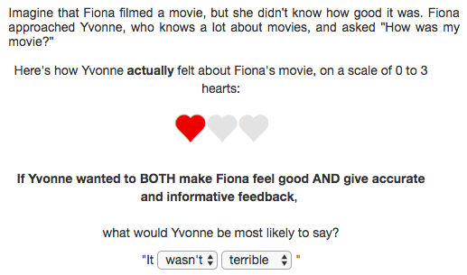

```{r load_packages, include = FALSE}
knitr::opts_chunk$set(echo=F, warning=F, cache=T, message=F, sanitize=T)
library("papaja")
library(tidyverse)
library(binom)
library(rwebppl)
library(jsonlite)
library(coda)
library(magrittr)
library(ggthemes)
library(forcats)
library(langcog)
library(gridExtra)
library(grid)

# set path to working dir
# local.path <- "~/Documents/Research/polgrice_GIT/"

estimate_mode <- function(s) {
  d <- density(s)
  return(d$x[which.max(d$y)])
}
hdi_upper <- function(s){
  m <- HPDinterval(mcmc(s))
  return(m["var1","upper"])
}
hdi_lower <- function(s){
  m <- HPDinterval(mcmc(s))
  return(m["var1","lower"])
}
options("scipen"=10)   
```

# One-sentence summary

Polite speech arises from desires to be helpful -- both epistemically and socially -- and to *appear* helpful. 

# Introduction

Human speech is an important means of exchanging information, but intriguingly it often deviates from maximally efficient and accurate information transfer.
Instead of saying the most direct message that the speaker wants the listener to access ("I know for a fact that you failed the exam"; "Open the window!"), 
Speakers produce vague or underinformative remarks ("I don't think you did very well on the exam") 
or add extraneous, seemingly irrelevant markers ("*could you please* open the window?").
People sometimes even produce false utterances that completely misrepresents the speaker's knowledge ("Your talk was great!" about a truly terrible talk). 

Polite language, in which speakers convey information in a false or indirect manner in consideration of listeners’ wants, violates a critical principle of cooperative communication: exchanging information efficiently and accurately [@grice1975].
Yet polite speech serves another important goal of communication: maintaining and improving social relationships.
Here we propose that cooperative communication reflects a principled tradeoff between two goals: epistemic goal, or to convey information accurately and efficiently; and social goal, or to make the interactants feel good. 
<!-- FIXME: self-presentational goal? -->

How can we model production of polite speech?
The Rational Speech Act (RSA) framework describes language understanding as recursive probabilistic inference between a pragmatic listener and an informative speaker.
This framework has been successful at capturing the quantitative details of a number of language understanding tasks but it neglects the social goals a speaker may pursue.
On the other hand, informal theories of politeness explain how speakers' social goals give rise to polite speech. For example, @brown1987 argue that deviation from informativity increases the level of polite face-saving. But there has been no formalization of the notion of speakers' social goals, thus no systemic quantitative predictions of politeness theories have been available.

We propose a computational model of polite speech (**pRSA**) that accounts for both epistemic and social goals of speakers.
RSA models assume speakers choose utterances approximately optimally given a utility function [@goodman2013].
In our model, the speaker’s utility function can be decomposed into two components: First, *epistemic utility* refers to the standard, informative utility in RSA: the amount of information a literal listener ($L_0$) would still not know about world state s after hearing a speaker’s utterance $w$. Second, *social utility* is the expected subjective utility of the state inferred given the utterance $w$. The expected subjective utility is related to the intrinsic value of the state, and we use a value function ($V$) to map states to subjective utility values. This captures the affective consequences for the listener of being in state $s$. The utility weight (single mixture parameter $\phi_{S_1}$) determines how informative versus social the speaker wants to be: a higher $\phi_{S_1}$ signifies the epistemic goal prioritized over the social goal. Finally, some utterances might be costlier than others. The utility of an utterance subtracts the cost $c(w)$ from the weighted combination of the social and epistemic utilities.
$$U(w; s; \phi]) = \phi_{S_1}\ \cdot L_0(s \mid w) + 
(1 - \phi_{S_1}) \cdot V[L_0(s \mid w)]  - C(w)$$ 

The recursive reasoning in our model unfolds as follows:
The speaker ($S_1$) in pRSA chooses utterances $w$ softmax-optimally given the state $s$ and his goal mixture parameter weight $\phi$. 
Given the speaker’s utterance, the pragmatic listener ($L_1$) jointly infers the state $s$ and the utility weight $\phi_{S_1}$. 
Finally, the pragmatic speaker ($S_2$) chooses an utterance, based on the pragmatic listener $L_1$'s model and one of three possible different goals he can have: 
(1) true epistemic goal to convey the true state ($\phi_{epistemic}$); 
(2) true social goal to make L1 feel good ($\phi_{social}$); 
(3) self-presentational goal to convey a certain $\phi_{S_1}$ to $L_1$ (i.e. to *appear* informative or kind; $\phi_{self}$).
$$P_{S_2}(w \mid s, \hat{\beta})\propto 
\mathrm{exp}( \phi_{epistemic}\ \cdot L_1(s \mid w) +
\phi_{social}\ \cdot V[L_1(s \mid w)] + 
\phi_{self}\ \cdot L_1(\phi_{S_1} \mid w) )$$

We used a simple procedure to empirically test whether our model is able to predict production of polite utterances.
Participants read scenarios in which someone (e.g. Ann) gave a performance of some kind, and another person (Bob) evaluated it. 
We provided information on Ann's feelings toward the presentation (*true state*), which were shown on a scale from zero to three hearts (e.g. two out of three hearts filled in red color; see Figure 1).
We also presented Ann's goal, which was one of the following: (1) to be *informative* and give accurate feedback; to be *social* and to make Bob feel good; or to be *both* informative and social at the same time. We hypothesized that speakers with both goals to be informative and social given bad true states (i.e. Bob's performance was poor) would produce more negation ("It wasn't~") to save the listener's face while vaguely conveying the bad true state (see our pre-registered model, hypothesis, and procedure at FIXME). Each participant read 12 scenarios total (4 true states $\times$ 3 goals).

In a single trial, each scenario was followed by a question that asked for the most likely utterance by Ann. Participants indicated their answer by choosing one of the options on the two dropdown menus, side-by-side, one for choosing between *It was* vs. *It wasn’t* and the other for choosing among *terrible*, *bad*, *okay*, *good*, and *amazing*, thereby selecting one of ten possible utterances (see Figure 1).
We separately gathered the literal meanings of the ten possible utterances, by measuring how likely each utterance is to be true given each true state, to set expected literal meanings of utterances in our model (see Supplementary Materials for literal semantic results).

 

```{r s2_data, echo=FALSE, message=FALSE, warning=FALSE}
d.utterance <- read.csv("data/speakerProduction.csv")

d <- d.utterance %>%
  separate(utterance, into = c("positivity", "utterance"), sep = "_") %>%
  mutate(true_state = as.factor(true_state),
         goal = as.factor(goal),
         positivity = as.factor(positivity),
         utterance = as.factor(utterance)
          )

ms2 <- d %>%
  filter(!is.na(positivity), !is.na(utterance)) %>%
  group_by(true_state, goal) %>%
  summarise(n.total=n())

ms3 <- d %>%
  filter(!is.na(positivity), !is.na(utterance)) %>% 
  group_by(true_state, goal, positivity, utterance) %>%
  summarize(n = n())

ms <- left_join(ms2, ms3) %>%
  group_by(true_state, goal, positivity, utterance) %>%
  summarize(mean = n / n.total,
            ci_lower = binom.bayes(n, n.total)$lower,
            ci_upper = binom.bayes(n, n.total)$upper) 
  
ms_fake <- expand.grid(true_state=levels(ms$true_state),
                             goal=levels(ms$goal),
                             positivity=levels(ms$positivity), 
                             utterance=levels(ms$utterance))

ms.all <- left_join(data.frame(ms_fake),data.frame(ms))

ms.all[is.na(ms.all)] <- 0

ms.all %<>%
  mutate(utterance = fct_relevel(utterance, 
                                 "terrible", "bad", "good", "amazing"),
         goal = fct_relevel(goal, 
                            "informative", "social", "both")) %>%
    # mutate(positivity = factor(positivity, levels = c("yes", "not")))
    mutate(positivity = factor(positivity, levels = c("not", "yes")))


# ggplot(data=ms.all, aes(x=utterance, y=mean, fill=positivity, group = positivity, color = positivity)) +
#   geom_line()+
#   facet_grid(goal~true_state) +
#   xlab("no negation (It was ~) vs negation (It wasn't ~) ") +
#   ylab("proportion chosen") +
#   geom_linerange(aes(ymin=ci_lower,ymax=ci_upper), position="dodge") +
#   geom_hline(yintercept=.1, lty=2) +
#   ylim(0,1)+
#   scale_color_solarized()+
#   ggthemes::theme_few()+
#   theme(axis.text.x = element_text(angle = 90)) +
#   ggtitle("Speaker production - Data only")
```

# Results

```{r utterancePrediction, echo=FALSE, fig.asp=.7, fig.cap="Experimental results (solid lines) and fitted model predictions (dashed lines) for speaker production. Proportion of utterances chosen (utterance type – direct vs. indirect – in different colors and words shown on x-axis) given the true states (columns) and speaker goals (rows). Error bars represent 95% confidence intervals for the data and 95% highest density intervals for the model. Black dotted line represents the chance level."}
load("data/bda-utterance-allMods.RData")

ms_model <- model.bda.utterance %>%     
  ungroup() %>%
  mutate(true_state = as.factor(state)) %>%
  ungroup() %>%
  select(-state) %>%
  mutate(
    model_MAP = as.numeric(as.character(MAP)),
    model_ci_upper = as.numeric(as.character(ci_upper)),
    model_ci_lower = as.numeric(as.character(ci_lower))) %>%
  mutate(utterance = as.factor(fct_relevel(utterance, 
                                 "terrible", "bad", "good", "amazing")),
         goal = as.factor(fct_relevel(goal, 
                            "informative", "social", "both"))) %>%
    mutate(positivity = factor(positivity, levels = c("yes", "not"))) %>%
  select(-MAP, -ci_upper, -ci_lower)

ms.all.utt <- rbind(
  ms.all %>%
    mutate(source = "data"),
  ms_model %>%
    mutate(mean = model_MAP,
           ci_lower = model_ci_lower,
           ci_upper = model_ci_upper,
           source = model) %>%
    select(true_state, goal, positivity, utterance, mean, ci_lower, ci_upper, source)
) %>%
  mutate(source = relevel(factor(source), "data")) %>%
  mutate(state = true_state)

ggplot(data=filter(ms.all.utt, source == "data" | source == "self5"), 
       aes(x=utterance, y=mean, group = interaction(positivity, source), colour = positivity, linetype = source)) +
  geom_line()+
  facet_grid(goal~state, labeller = label_both) +
  xlab("utterance") +
  ylab("proportion chosen") +
  geom_linerange(aes(ymin=ci_lower,ymax=ci_upper), position="dodge") +
  geom_hline(yintercept=.1, lty=2) +
  ylim(0,1)+
  scale_color_solarized(labels = c("indirect (it wasn't~)","direct (it was~)"))+
  ggthemes::theme_few()+
  theme(axis.text.x = element_text(angle = 90)) +
  # ggtitle("Speaker production - data vs. model") +
  guides(colour=guide_legend(title="utterance type")) +
  scale_linetype_discrete(labels = c("data", "model"))
```

```{r varianceExplained, echo=FALSE, fig.cap="Full distribution of human responses vs. model predictions. Error bars represent 95% confidence intervals for the data (vertical) and 95% highest density intervals for the model (horizontal)."}

# FIXME: include zoom in? If so add to the caption:  Right bottom: zoomed in to the response and prediction proportion ranging from 0 to 0.12. 

ms.all.utt %<>%
  mutate(source2 = ifelse(source=="data", "data", "model"))

ms.all3 <- ms.all.utt %>%
  select(-source2) %>%
  gather(var, value, mean:ci_upper) %>%
  unite(new, c(source, var)) %>%
  spread(new, value)

a <- ggplot(ms.all3,
       aes(x = self5_mean, y = data_mean)) +
  aes(shape = factor(positivity)) +
  geom_point(aes(colour = factor(goal), fill = factor(goal)), size = 2) +
  scale_shape(solid = FALSE) +
  scale_shape_manual(name = "utterance type", values = c(24, 25))+
  theme_few()+
  geom_abline(intercept = 0, slope = 1, linetype = 3) +
  geom_errorbar(aes(ymin=data_ci_lower,ymax=data_ci_upper), alpha = 0.3) +
  geom_errorbarh(aes(xmin=self5_ci_lower,xmax=self5_ci_upper), alpha = 0.3) +
  xlab("Model posterior predictive") +
  ylab("Human proportion responses") +
  ylim(0,1) +
  xlim(0,1) +
  scale_y_continuous(breaks=c(0, 0.25, 0.5, 0.75, 1)) +
  scale_x_continuous(breaks=c(0, .25, 0.5, 0.75, 1)) +
  theme(axis.text.y = element_text(hjust = 0, angle = 90),
        axis.text.x = element_text(vjust = 0, angle = 0)) +
  coord_fixed()+
  scale_colour_solarized(name = "goal") +
  scale_fill_solarized() +
  guides(fill=FALSE)
  # ggtitle("Human responses vs model predictions")

b <- ggplot(ms.all3,
       aes(x = self5_mean, y = data_mean)) +
  aes(shape = factor(positivity)) +
  geom_point(aes(colour = factor(goal), fill = factor(goal)), size = 2) +
  scale_shape(solid = FALSE) +
  scale_shape_manual(name = "utterance type", values = c(24, 25))+
  theme_few()+
  geom_abline(intercept = 0, slope = 1, linetype = 3) +
  geom_errorbar(aes(ymin=data_ci_lower,ymax=data_ci_upper), alpha = 0.3) +
  geom_errorbarh(aes(xmin=self5_ci_lower,xmax=self5_ci_upper), alpha = 0.3) +
  xlab(NULL) +
  ylab(NULL) +
  coord_fixed()+
  coord_cartesian(ylim=c(0, .12), xlim=c(0, .12))+
  theme(axis.ticks.length=unit(.05, "cm")) +
  theme(axis.text.y = element_text(hjust = 0, angle = 90),
        axis.text.x = element_text(vjust = 0, angle = 0)) +
  scale_y_continuous(breaks=c(0, 0.1, 0.2)) +
  scale_x_continuous(breaks=c(0, 0.1, 0.2)) +
  scale_colour_solarized(guide=FALSE) +
  scale_fill_solarized() +
  guides(fill=FALSE, shape=FALSE)

a
# a + annotation_custom(ggplotGrob(b), xmin = .45, ymin = -0.05,
#                               xmax = 1, ymax=.5)

cor2_self5 = with(ms.all3, cor(data_mean, self5_mean))^2

```

```{r negationPrediction, echo=FALSE, fig.width=9, fig.height=3.5, fig.cap="Experimental results (left) and fitted model predictions (right) for average proportion of negation produced among all utterances, given true states (x-axis) and goals (colors)."}
d <- d.utterance %>%
  separate(utterance, into = c("positivity", "utterance"), sep = "_") %>%
  mutate(true_state = as.factor(true_state),
         goal = as.factor(goal),
         positivity = as.factor(positivity),
         utterance = as.factor(utterance)
          )


ms2 <- d %>%
  filter(!is.na(positivity), !is.na(utterance)) %>% # why is there NA?
  group_by(true_state, goal) %>%
  summarise(n.total=n())

ms3 <- d %>%
  filter(!is.na(positivity), !is.na(utterance)) %>% # why is there NA?
  group_by(true_state, goal, positivity) %>%
  summarize(n = n())

ms <- left_join(ms2, ms3) %>%
  group_by(true_state, goal, positivity) %>%
  summarize(mean = n / n.total,
            ci_lower = binom.bayes(n, n.total)$lower,
            ci_upper = binom.bayes(n, n.total)$upper) 
  
ms_fake <- expand.grid(true_state=levels(ms$true_state),
                             goal=levels(ms$goal),
                             positivity=levels(ms$positivity))

ms.all2 <- left_join(data.frame(ms_fake),data.frame(ms))

ms.all2[is.na(ms.all2)] <- 0

ms.all2 %<>%
  # mutate(utterance = fct_relevel(utterance, 
                                 # "terrible", "bad", "okay", "good", "amazing"),
         mutate(goal = fct_relevel(goal, 
                            "informative", "social", "goal")) %>%
  mutate(source = "data")


ms.all2 <- rbind(
  as.data.frame(ms.all2), 
  as.data.frame(
    ms.all.utt %>%
    filter(source != "data") %>%
    group_by(source, true_state, goal, positivity) %>%
    summarize(
      sum_mean = sum(mean),
              ci_lower = sum_mean-sqrt(sum((mean-ci_lower)^2)),
              ci_upper = sum_mean+sqrt(sum((mean-ci_upper)^2))
              ) %>%
      mutate(mean = sum_mean) %>%
      select(-sum_mean)
    )
) %>%
  mutate(source = relevel(factor(source), "data"))

ms.all2 %>%  
  mutate(source = factor(source, levels = c("data", "self5", "actual2", "self6", "self7"))) %>%
  filter(source == "self5" | source == "data") %>%
  mutate(source = fct_recode(source,
                             "model" = "self5"
                             )) %>%
  filter(positivity == "not") %>%
  ggplot(., 
       aes(x=true_state, y=mean, color = goal, group=goal)) +
  geom_line(stat="identity", position=position_dodge()) +
  xlab("true state") +
  ylab("proportion negation") +
  geom_linerange(aes(ymin=ci_lower,ymax=ci_upper), position=position_dodge(width=.15)) +
  # scale_colour_discrete(guide = guide_legend(title = "utterance type")) +
  theme_few(base_size = 17)+
  scale_color_solarized() +
  # ggtitle("Proportion negation: model vs. data") +
  facet_grid(.~source)
```

Mean proportion of utterances chosen by participants in each true-state $\times$ goal condition were overall highly consistent with the our model predictions (Figure \@ref(fig:utterancePrediction)). 
The posterior predictive of the model explained almost all of the variance in the production data $r^2$(96) = `r cor2_self5` (Figure \@ref(fig:varianceExplained)).
Consistent 
In line with our hypothesis, the both-goal speaker $\times$ bad true state (0 or 1 heart) conditions yielded the greatest proportion of negation ("It wasn't ~"; see Figure \@ref(fig:negationPrediction)).

Our work unifies previous formal models of communication and informal theories of social uses of language. Our findings suggest that neither epistemic nor social motives alone motivate polite speech; instead, production of polite speech results from the conflict between these two, combined with a self-presentational desire to *look* epistemically and socially helpful. These findings provide strong support for a utility-theoretic framing of politeness, and suggest new directions in understanding of pragmatic language use in social contexts.

# Appendices

## Literal semantic judgments

```{r litSem, echo=FALSE, message=FALSE, warning=FALSE, fig.width=9, fig.height=2.5, fig.cap="Semantic measurement results. Proportion of acceptances of utterance types (colors) combined with target words (facets) given the true state represented on a scale of hearts. Error bars represent 95% confidence intervals."}
d <- read.csv("data/literalSemantics.csv") %>%
  select(-X)

d <- d %>%
  mutate(subid = as.factor(subid)) %>%
  mutate(state = as.factor(state)) %>%
  mutate(utterance = as.factor(utterance)) %>%
  mutate(judgment = as.numeric(as.character(judgment))) %>%
  mutate(positivity = factor(as.numeric(grepl("yes", utterance)), 
                        levels = c(0, 1), 
                        labels = c("negative","positive"))) %>%
  mutate(utterance = as.factor(substring(utterance, 5))) %>%
  select(subid, state, positivity, utterance, judgment) %>%
  mutate(utterance = ordered(utterance, levels = c("terrible", "bad", "good", "amazing")),
         positivity = ordered(positivity, levels = c("negative", "positive")),
         positivity = factor(positivity, labels = c("it wasn't ___", "it was ___"))
         ) 

ms <- d %>%
  group_by(positivity, state, utterance, subid) %>%
  summarize(
            judgment = mean(judgment, na.rm=TRUE)
          ) %>%
  group_by(positivity, state, utterance) %>%
  multi_boot_standard(col = "judgment") %>%
  mutate(judgment = mean) %>%
  mutate(data = "4pred")

qplot(state, judgment,
      colour = positivity,
      data=ms) +
  geom_line(aes(group=positivity)) +
  facet_grid(.~utterance) +
  xlab("state (1=worst)") +
  ylab("proportion \n acceptances") +
  geom_errorbar(aes(ymin=ci_lower,ymax=ci_upper,width=.1)) +
  scale_color_solarized(labels=c("it wasn't ~","it was ~")) +
  guides(colour=guide_legend(title=NULL)) +
  ggthemes::theme_few(base_size = 17)
  # theme(legend.title = element_blank())
```

## Inferred parameters

```{r goalWeights, echo=FALSE, fig.cap = "Inferred goal weights. Horizontal facets are different experimental conditions (trying to be X). Density plots show likely weights used in the speaker’s utility function."}
#### goal weights
load("data/bda-goalWeights.RData")

model.bda.goalWeights.mean <- model.bda.goalWeights %>%
  group_by(goal, model, phi0, phi) %>%
  summarise(mean = mean(val))

ggplot(filter(model.bda.goalWeights,
              model == "self5"
                ), aes(x = val, fill = phi))+
  # geom_histogram(binwidth=0.025, position = position_dodge())+
  geom_density(alpha=0.7, bw=0.02) +
  xlab("Inferred weight") +
  facet_grid(goal~phi0)+
  geom_vline(data=filter(model.bda.goalWeights.mean, phi0=="s2", model=="self5"),
             aes(xintercept=mean, colour=phi),
  linetype="dashed", size=1)  +
  geom_vline(data=filter(model.bda.goalWeights.mean, phi0=="s1", model=="self5"),
             aes(xintercept=mean, colour=phi),
  linetype="dashed", size=1)  +
  theme_few()+
  scale_fill_manual(values=c("#6c71c4", "#268bd2", "#859900", "#dc322f"))+
  scale_color_manual(values=c("#859900", "#6c71c4", "#268bd2", "#dc322f"), guide=FALSE)
  # ggtitle("Inferred goal weights by speaker condition")
```

```{r params, echo=FALSE, fig.height=2.5, fig.cap="Inferred cost and speaker optimality parameters from the main model."}
model.bda.params <- model %>%
  select(model, chain, speakerOptimality, cost) %>%
  gather(param, val, speakerOptimality:cost)

model.bda.params %>%
  filter(model == "self5") %>%
  ggplot(., aes(x = val, fill = param))+
  # geom_histogram()+
  geom_density(alpha=.7, bw=.2)+
  facet_grid(.~param, scales = "free") +
  # ggtitle("Inferred parameters") +
  scale_fill_solarized()+
  theme_few()

cor_costOpt = cor.test(model$speakerOptimality, model$cost)$cor
```

## Data analysis tools 

We used `r cite_r("politeness.bib")` for all our analyses.

## Model parameter and weight comparison

Here we compare predictions of the current model with its possible alternatives. The current model has a triple mixture structure, with three goals each of which is assigned a different weight: (1) goal to be truly informative (i.e. want to convey the true state); (2) goal to be truly social (i.e. want to make the listener feel good); (3) self-presentational goal to appear certain way (as determined by s1-phi). Alternative models involve one or two out of these three components. Below we show that the current model best captures the production pattern in the empirical data.

<!-- FIXME: variance explained and bayes factor -->

```{r utterancePredictionComp, echo=FALSE, fig.cap="Utterances from data (leftmost) and predictions from different model alternatives for a speaker with both goals addressing the true state of 0 heart. Proportion of utterances chosen (direct utterances in solid lines and indirect utterances in dotted lines, and words shown on x-axis). Error bars represent 95% confidence intervals for the data and 95% highest density intervals for the model. Black dotted line represents the chance level.", fig.height=2}
# FIXME: change order to show ranking for best prediction?
ms.all.utt %>%
  mutate(source2 = ifelse(source=="data", "data", "model")) %>%
  mutate(source = factor(source, levels = c("data", "self5", "actual2", "self6", "self7", "trueInf", "trueSocial", "selfPres"))) %>%
  mutate(source = fct_recode(source,
                             "model: \ntrue informative, \n true social" = "actual2",
                             "model: \nself-presentational, \n true informative, \n true social" = "self5",
                             "model: \nself-presentational, \n true informative" = "self6", 
                             "model: \nself-presentational, \n true social" = "self7",
                             "model: \ntrue informative only" = "trueInf",
                             "model: \ntrue social only" = "trueSocial",
                             "model: \nself-presentational only" = "selfPres"
                             )) %>%
  mutate(positivity = fct_recode(positivity,
                                 "it was ~" = "yes",
                                 "it wasn't ~" = "not")) %>%
  filter(true_state == "0", goal == "both") %>%
ggplot(., 
       aes(x=utterance, y=mean, fill=positivity, group = interaction(positivity, source), linetype = forcats::fct_rev(positivity), colour = source)) +
  geom_line()+
  facet_grid(.~source) +
  xlab("utterance") +
  ylab("proportion chosen") +
  geom_linerange(aes(ymin=ci_lower,ymax=ci_upper), position="dodge") +
  geom_hline(yintercept=.1, lty=2) +
  ylim(0,.5)+
  scale_color_solarized(guide=FALSE)+
  ggthemes::theme_few(base_size = 6)+
  theme(axis.text.x = element_text(angle = 90)) +
  # ggtitle("Model comparison: Both-goal speaker production given 0-heart state") +
  guides(linetype=guide_legend(title=NULL))
```

```{r negationPredictionComp, echo=FALSE, fig.cap="Experimental results (leftmost) and predictions from different model alternatives for average proportion of negation produced among all utterances, given true states (x-axis) and goals (colors).", fig.height=2}
d <- d.utterance %>%
  separate(utterance, into = c("positivity", "utterance"), sep = "_") %>%
  mutate(true_state = as.factor(true_state),
         goal = as.factor(goal),
         positivity = as.factor(positivity),
         utterance = as.factor(utterance)
          )


ms2 <- d %>%
  filter(!is.na(positivity), !is.na(utterance)) %>% # why is there NA?
  group_by(true_state, goal) %>%
  summarise(n.total=n())

ms3 <- d %>%
  filter(!is.na(positivity), !is.na(utterance)) %>% # why is there NA?
  group_by(true_state, goal, positivity) %>%
  summarize(n = n())

ms <- left_join(ms2, ms3) %>%
  group_by(true_state, goal, positivity) %>%
  summarize(mean = n / n.total,
            ci_lower = binom.bayes(n, n.total)$lower,
            ci_upper = binom.bayes(n, n.total)$upper) 
  
ms_fake <- expand.grid(true_state=levels(ms$true_state),
                             goal=levels(ms$goal),
                             positivity=levels(ms$positivity))

ms.all2 <- left_join(data.frame(ms_fake),data.frame(ms))

ms.all2[is.na(ms.all2)] <- 0

ms.all2 %<>%
  # mutate(utterance = fct_relevel(utterance, 
                                 # "terrible", "bad", "okay", "good", "amazing"),
         mutate(goal = fct_relevel(goal, 
                            "informative", "social", "goal")) %>%
  mutate(source = "data")


ms.all2 <- rbind(
  as.data.frame(ms.all2), 
  as.data.frame(
    ms.all.utt %>%
    filter(source != "data") %>%
    group_by(source, true_state, goal, positivity) %>%
    summarize(
      sum_mean = sum(mean),
              ci_lower = sum_mean-sqrt(sum((mean-ci_lower)^2)),
              ci_upper = sum_mean+sqrt(sum((mean-ci_upper)^2))
              ) %>%
      mutate(mean = sum_mean) %>%
      select(-sum_mean)
    )
) %>%
  mutate(source = relevel(factor(source), "data"))

ms.all2 %>%  
  mutate(source = factor(source, levels = c("data", "self5", "actual2", "self6", "self7", "trueInf", "trueSocial", "selfPres"))) %>%
  mutate(source = fct_recode(source,
                             "model: \ntrue informative, \n true social" = "actual2",
                             "model: \nself-presentational, \n true informative, \n true social" = "self5",
                             "model: \nself-presentational, \n true informative" = "self6", 
                             "model: \nself-presentational, \n true social" = "self7",
                             "model: \ntrue informative only" = "trueInf",
                             "model: \ntrue social only" = "trueSocial",
                             "model: \nself-presentational only" = "selfPres"
                             )) %>%
  filter(positivity == "not") %>%
  ggplot(., 
       aes(x=true_state, y=mean, color = goal, group=goal)) +
  geom_line(stat="identity", position=position_dodge()) +
  xlab("true state") +
  ylab("proportion negation") +
  geom_linerange(aes(ymin=ci_lower,ymax=ci_upper), position=position_dodge(width=.15)) +
  # scale_colour_discrete(guide = guide_legend(title = "utterance type")) +
  theme_few()+
  ggthemes::theme_few(base_size = 6)+
  scale_color_solarized() +
  # ggtitle("Proportion negation: model vs. data") +
  facet_grid(.~source)
```

```{r goalWeightsComp, fig.cap="Inferred goal weights from different model alternatives. Horizontal facets are different experimental conditions (trying to be X). Density plots show likely weights used in the speaker’s utility function."}
model.bda.goalWeights.mean %<>%
  ungroup() %>%
  mutate(model = fct_recode(model,
                             "model: \ntrue informative, \n true social" = "actual2",
                             "model: \nself-presentational, \n true informative, \n true social" = "self5",
                             "model: \nself-presentational, \n true informative" = "self6", 
                             "model: \nself-presentational, \n true social" = "self7",
                             "model: \ntrue informative only" = "trueInf",
                             "model: \ntrue social only" = "trueSocial",
                             "model: \nself-presentational only" = "selfPres"
                             ))


model.bda.goalWeights %>%
  filter(goal == "both") %>%
  mutate(model = fct_recode(model,
                             "model: \ntrue informative, \n true social" = "actual2",
                             "model: \nself-presentational, \n true informative, \n true social" = "self5",
                             "model: \nself-presentational, \n true informative" = "self6", 
                             "model: \nself-presentational, \n true social" = "self7",
                             "model: \ntrue informative only" = "trueInf",
                             "model: \ntrue social only" = "trueSocial",
                             "model: \nself-presentational only" = "selfPres"
                             )) %>%

ggplot(., 
       aes(x = val, fill = phi))+
  # geom_histogram(binwidth=0.05, position = position_dodge())+
  geom_density(alpha=0.7) +
  facet_grid(model~phi0)+
  geom_vline(data=filter(model.bda.goalWeights.mean, phi0=="s2", goal == "both"),
             aes(xintercept=mean, colour=phi),
  linetype="dashed", size=1)  +
  geom_vline(data=filter(model.bda.goalWeights.mean, phi0=="s1", goal == "both", model != "actual2"),
             aes(xintercept=mean, colour=phi),
  linetype="dashed", size=1)  +
  theme_few()+
  ggthemes::theme_few(base_size = 7)+
  scale_fill_manual(values=c("#6c71c4", "#268bd2", "#859900", "#dc322f"))+
  scale_color_manual(values=c("#859900", "#6c71c4", "#268bd2", "#dc322f"), guide=FALSE)
  # ggtitle("Comparing model alternatives: \n Goal weights predicted for both-goal condition")
```

```{r varianceExplainedComp, echo=FALSE}
cor2_actual2 = with(ms.all3, cor(data_mean, actual2_mean))^2

cor2_self6 = with(ms.all3, cor(data_mean, self6_mean))^2

cor2_self7 = with(ms.all3, cor(data_mean, self7_mean))^2
```

\newpage

# References
```{r create_r-references}
r_refs(file = "politeness.bib")
```

\setlength{\parindent}{-0.5in}
\setlength{\leftskip}{0.5in}
